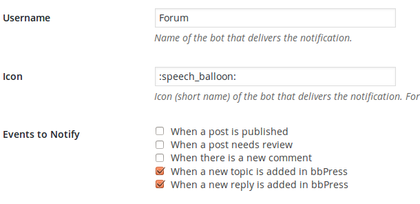
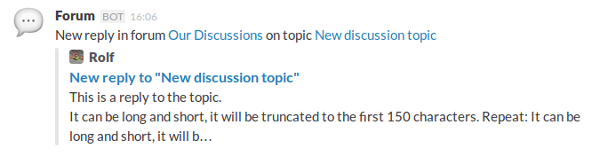

# wp-slack-bbpress

Wordpress plugin to send notifications to Slack channels for events in bbPress.

This is an extension for [the Slack plugin](https://wordpress.org/plugins/slack/).

Currently it requires [my forked version with the added feature to send
Slack attachments](https://github.com/rolfkleef/wp-slack/tree/slack-attachments).

Once activated, it adds two triggers in the admin settings:

It will create a notification when a new topic is added:

And it will create a notification when a new reply is added:

